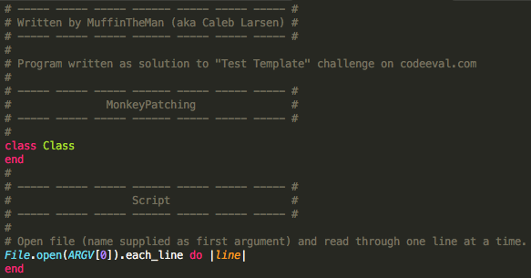
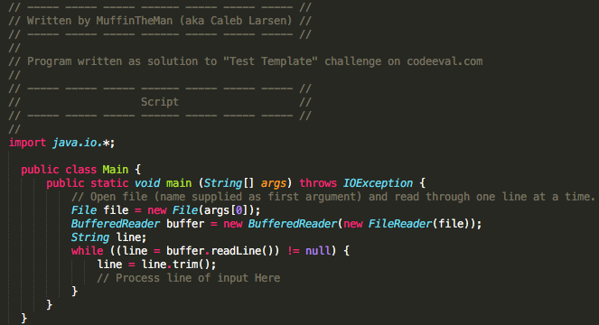

# covalgen

CodeEval solution template generator script.

It's a hacky way to do it, but first open the file `classes.rb` and change `AUTHOR` to whatever you would like to use for your name.

Begin program with `ruby generate.rb` and follow the prompts to setup your solution template. Your template should look similar to the following example (for a solution to be written in Ruby):

Or (for a solution to be written in Java):

Once finished with the setup, you will find your template under the folder that corresponds to your challenge's difficulty level. For example:

`moderate/incomplete/flavius_josephus-rb/`

Once you have successfully submitted your solution and wish to move it from the `incomplete` folder to the `complete` folder, run `. ./finish.sh`

## To Do:

- Create less-hacky settings (maybe yaml or something)
- Automatically change to the new directory after setup script